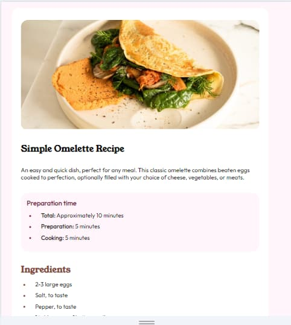

# Frontend Mentor - Recipe page solution

This is a solution to the [Recipe page challenge on Frontend Mentor](https://www.frontendmentor.io/challenges/recipe-page-KiTsR8QQKm). Frontend Mentor challenges help you improve your coding skills by building realistic projects. 

## Table of contents

- [Overview](#overview)
  - [The challenge](#the-challenge)
  - [Screenshot](#screenshot)
  - [Links](#links)
- [My process](#my-process)
  - [Built with](#built-with)
  - [What I learned](#what-i-learned)
  - [Continued development](#continued-development)
  - [Useful resources](#useful-resources)
- [Author](#author)
- [Acknowledgments](#acknowledgments)

## Overview

### Screenshot
#### Desktop Preview


#### Movile Preview


### Links

- Solution URL: [GitHub respository](https://github.com/dartorrejon/simple-omelette-challenge)
- Live Site URL: [Simple Omelette Recipe](https://dartorrejon.github.io/simple-omelette-challenge/)

## My process

### Built with

- Semantic HTML5 markup
- Custom fonts: _@font-face_
- CSS custom properties
- Flexbox
- CSS Grid
- Mobile-first workflow
- Media Queries

### What I learned

I learned to use "font-face", which allows me to add fonts that I had in a local folder. I also put into practice the use of grid and flex to align the page.

I add some code snippets in the section below as an example of the work done:

```html
 <section class="nutrition">
        <h2 class="nutrition-title">Nutrition</h2>
        <p> The table below shows nutritional values per serving without the additional fillings.</p>
        <div class="nutrition-table">
          <div class="nutrition-values">
            <div>Calories</div>
            <div>277kcal</div>
          </div>
          <hr>
          <div class="nutrition-values">
            <div>Carbs</div>
            <div>0g</div>
          </div>
          <hr>
          <div class="nutrition-values">
            <div>Protein</div>
            <div>20g</div>
          </div>
          <hr>
          <div class="nutrition-values">
            <div>Fat</div>
            <div>22g</div>
          </div>
        </div>
      </section>
```
```css
@font-face{
    font-family: 'Outfit';
    src: url(./assets/fonts/outfit/Outfit-VariableFont_wght.ttf) format('truetype');
    font-weight: 400;
    font-style: normal;
}
@font-face{
    font-family: 'Young Serif';
    src: url(./assets/fonts/young-serif/YoungSerif-Regular.ttf) format('truetype');
    font-weight: 400;
    font-style: normal;
}
```
### Continued development


I would like to continue improving in CSS, I know I learned a lot this time but there are many more things that I want to improve, such as @keyfreames or @media queries. I would also like to implement BEM (_Block-Element-Modifier_) methodology in the future.

### Useful resources

- [GH Pages](https://github.com/) - Very useful page to upload simple projects💻.
- [mdn_]() - This is the bible of every frontend programmer. Don't hesitate to consult it!📖

- [Scquoosh](https://squoosh.app/editor) - 
Very useful page to optimize the size of the images to have better performance when rendering them.

## Author

- Website - [My personal GitHub](https://github.com/dartorrejon)
- Frontend Mentor - [@dartorrejon](https://www.frontendmentor.io/profile/dartorrejon)


## Acknowledgments

For now, with these simple projects, only get inspiration from the screenshots that are included in it.
